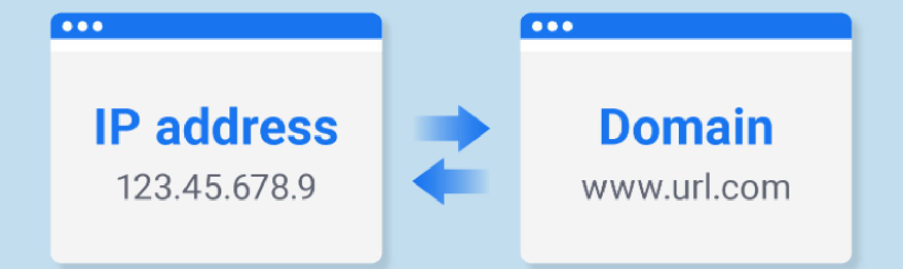

# Building A Static Website With Go Hugo

## Why this mini-series tutorial?


The main goal of this mini-series is not to teach you Web Technology, but to 
walk through the main steps for 
building a static website, and to learn to use, in the meanwhile:
- Git (branching, submodule, remote, webhook, pull request etc.)
- Docker (Dockerfile, multi-stage build, shipping to DockerHub etc.)
- Some very useful linux commands (e.g. nohup, scp, etc.)
- Some very useful DevOps tools (e.g. Nginx, live server, Github actions, CI/CD, etc.)
- Some very useful Python programming frameworks (os, subprocess, FastPAI, Uvicorn, etc.)
- Various cloud platforms (cloud VM, public IP, domain registration, domain binding, etc.)

Those skills are quite versatile and could be very useful when you create your website 
with other static web generators (e.g. Hexo, Jekyll etc.), dynamic web frameworks, 
as well as in many DevOps scenarios.

***Notice: If you just want to build your own personal website, you need only to watch videos 1-5, whose total length is ~30 minutes.***

## Code


:rocket: All code used in the videos can be found in this repository, hosted
on GitHub as well as on Gitee.com:
- https://gitee.com/lundechen/static_website_with_go_hugo
- https://github.com/pageshu/pageshu.github.io

With the corresponding website:
- https://pageshu.github.io/

## Bilibili videos


***Notice: If you just want to build your own personal website, you need only to watch videos 1-5, whose total length is ~30 minutes.***

- Introduction 
  - [Video 1 - Introduction](https://www.bilibili.com/video/BV1DU4y1m7NX/)
- Setup 
  - [Video 2 - Setup](https://www.bilibili.com/video/BV1JZ4y187CG/)
- Quick Start
  - [Video 3 - Quick Start](https://www.bilibili.com/video/BV1V34y1E7hy/)
- Localhost Pages
  - [Video 4 - Localhost Pages](https://www.bilibili.com/video/BV1Wv4y1A75F/)
- GitHub Pages
  - [Video 5 - Github Pages](https://www.bilibili.com/video/BV1V5411R7EM/)
- Cloud VM Pages
  - [Video 6 - Cloud VM Pages](https://www.bilibili.com/video/BV1PY4y1t746/)
- Pages with Your Own Domain Name

## Setup 

###  Install git


#### Windows
Install [git for Windows](https://gitforwindows.org/).

#### MacOS
On Mavericks (10.9) or above you can do this simply by trying to 
run git from the Terminal the 
very first time. 

```shell script
git --version
```
If you don’t have it installed already, it will prompt you to install it.

#### Linux
Git is installed by default on Linux.

### Install Go


Installation package: https://go.dev/dl/

To check if Go is installed:
```shell script
go version
```

###  Install Hugo (extended version)


#### Windows
Download [Hugo executable](https://github.com/gohugoio/hugo/releases) (extended version), then [add its path to environment variable](https://www.computerhope.com/issues/ch000549.htm).

#### Linux
```sudo apt -y install hugo```
#### MacOS: 
```brew install hugo```

###  Install VS Code and extensions


Install VS Code, and add those extensions: 
- Hugo Language and Syntax Support
- Live Server

## Creating Hugo website


*This section is adapted from: https://gohugo.io/getting-started/quick-start/*

### Create a New Site
```shell script
hugo new site pageshu 
```
### Add a Theme
See [themes.gohugo.io](https://themes.gohugo.io/) for a list of themes to consider. 

Other free Hugo themes:
- https://jamstackthemes.dev/ssg/hugo/
- https://cloudcannon.com/blog/top-10-hugo-themes-for-2022/

A very popular personal site theme among academic researchers:
- https://github.com/wowchemy/starter-hugo-academic

If you are willing to pay ~360RMB for buying a high-quality theme:
- https://gethugothemes.com/

This tutorial uses the beautiful [Ananke theme](https://themes.gohugo.io/themes/gohugo-theme-ananke/).

First, download the theme from GitHub and add it to your site’s themes directory:
```shell script
cd pageshu
git init
git submodule add git@github.com:theNewDynamic/gohugo-theme-ananke.git themes/ananke
# or: git submodule add https://github.com/theNewDynamic/gohugo-theme-ananke.git themes/ananke
```

Then, add the theme to the site configuration ```config.toml```:
```shell script
theme = "ananke"
```

### Add Some Content


#### Markdown language
Markdown is very simple to learn.
- https://github.com/adam-p/markdown-here/wiki/Markdown-Cheatsheet
- https://www.makeuseof.com/tag/learning-markdown-write-web-faster/

#### Create markdown file
- You can manually create content files 
(for example as ```content/<CATEGORY>/<FILE>.<FORMAT>```) 
and provide metadata in them.
- However you can use the new command to do a few things for you (like add title and date):
```shell script
hugo new posts/my-first-post.md
```

#### Start the Hugo server
Now, start the Hugo server with drafts enabled:
```shell script
hugo server -D
```
Navigate to your site at http://localhost:1313/.

#### Build static pages
It is simple. Just call:
```shell script
hugo -D
```
Output will be in ```./public/``` directory by default 
(```-d/--destination``` flag to change it, or set ```publishdir``` in the config file).


#### Using ExampleSite
If you wanna start with more content prepared already, you could 
- copy/move files and folders within ```pageshu/themes/ananke/exampleSite``` to ```pageshu/```.
- Delete line ```baseURL = "...." ``` in ```config.toml```.
- Change line ```resourceDir = "../resources"``` to ```resourceDir = "resources"```
- Change line ```theme = ["github.com/theNewDynamic/gohugo-theme-ananke"]``` to ```theme = "ananke"```


Run ```hugo server -D``` again and you have the example site.

#### Mobile version of the website


Our website should be **responsive**.

-  ```F12```
-  ```Ctrl + Shift + M```

## Serving static pages on localhost 


### Live Server

```shell script
hugo -D --minify --baseURL=http://127.0.0.1:5500/public
```

On VS Code, click *Go Live* to open Live Server extension.

## Serving static pages on GitHub pages


### Reference
You could refer to those links to learn more about this topic.
- *https://gohugo.io/hosting-and-deployment/hosting-on-github/*
- *https://docs.github.com/en/pages/quickstart*
- *https://medium.com/@asishrs/automate-your-github-pages-deployment-using-hugo-and-actions-518b959a51f9*
- *https://www.morling.dev/blog/automatically-deploying-hugo-website-via-github-actions/*

### Repository in video
In the video, I used this repository:
- https://github.com/pageshu/pageshu.github.io

The corresponding github pages:
- https://pageshu.github.io/

### SSH Keys for GitHub


You can refer to those blogs for how to generate public rsa id and copy it the 
GitHub. In this manner, your machine can communicate with GitHub server via 
ssh protocol instead of HTTPS, and you won't need to provide your GitHub account and
password each time.

- https://jdblischak.github.io/2014-09-18-chicago/novice/git/05-sshkeys.html

- https://www.w3docs.com/snippets/git/how-to-generate-ssh-key-for-git.html


### Create ```.gitignore``` file


```text
.idea
.vscode
public
resources/_gen/
.DS_Store
node_modules
dist
tmp
*.lock
```

### Push you code to GitHub

Create a github repository ```<YOUR-GITHUB-USER-NAME-OR-ORGANIZATION-NAME>.github.io```, e.g. ```pageshu.github.io```. Note that 
```<YOUR-GITHUB-USER-NAME-OR-ORGANIZATION-NAME>``` should be unique and has not been used by other GitHub users or orgaizations.

Push you code to GitHub:
```shell script
git add .
git commit -m "source code for hugo website"
git remote add origin git@github.com:<YOUR-GITHUB-USER-NAME-OR-ORGANIZATION-NAME>/<YOUR-GITHUB-USER-NAME-OR-ORGANIZATION-NAME>.github.io.git
git push -u origin master
```

### Create a new branch


Creating a new branch ```gh-pages``` in GitHub:
```shell script
git checkout --orphan gh-pages
git rm -rf .
git commit --allow-empty -m "create empty gh-pages branch"
git push origin gh-pages
git checkout master
```

### Github Actions


The notion of Github Actions is closely related to
CI/CD (Continuous Integration & Continunous Deployment).


```yaml
name: pageshu

on:
  push:
    branches:
    - master

jobs:
  build-deploy:
    runs-on: ubuntu-20.04
    steps:
    - uses: actions/checkout@master
      with:
        submodules: true

    - name: Setup Hugo
      uses: peaceiris/actions-hugo@v2
      with:
        hugo-version: '0.86.0'
        extended: true

    - name: Build
      run: hugo --minify --baseURL=https://<YOUR-GITHUB-USER-NAME-OR-ORGANIZATION-NAME>.github.io

    - name: Deploy
      uses: peaceiris/actions-gh-pages@v3
      with:
        deploy_key: ${{ secrets.ACTIONS_DEPLOY_KEY }}
        publish_branch: gh-pages
        publish_dir: ./public
        allow_empty_commit: true
```

To learn more about GitHub Actions:
- https://yonatankra.com/7-github-actions-tricks-i-wish-i-knew-before-i-started/


## Git collaboration via GitHub pull request

A very good tutorial :point-right: :[分支创建+pr-by孙胡蝶.docx](分支创建+pr-by孙胡蝶.docx).


## Serving static pages on Cloud Virtual Machine


### Buy and connect to cloud VM


I have made a video explaining how :point_down: :
- https://www.bilibili.com/video/BV1nZ4y1k7Nr/

:point_up: 没有使用过云虚拟机的同学，先看下这个视频学习一下。

### Copy files to Cloud VM
Copy files to Cloud VM:
```shell script
scp -r ../pageshu root@116.205.139.7:~/ # use Git Bash
ssh root@116.205.139.7
git submodule update --recursive
```

### Hugo server, from the Cloud VM
```shell script
sudo nohup hugo server --bind=192.168.0.61 --baseURL=http://116.205.139.7 -p 8108 >> ~/nohup.txt &
```

### Docker

I made a video explaining the what and how of Docker:
- video: https://www.bilibili.com/video/BV1kL4y1g7Xd/
- corresponding website: https://docker-curriculum.com/

### Nginx


```shell script
ssh root@116.205.139.7
cd pageshu
sudo hugo --minify --baseURL=http://116.205.139.7:8818
cd public
touch Dockerfile
```

Add following lines into Dockerfile (```vi Dockerfile```):
```shell script
FROM nginx:latest
COPY . /usr/share/nginx/html/
```

Build run docker image and run docker container:
```shell script
sudo docker build -t pageshuimage .
sudo nohup docker run -it --rm -d -p 8818:80 --name pageshucontainer pageshuimage > ~/pageshu.txt &
```

Now, you can visit the website at: http://116.205.139.7:8818


## Serving static pages with your own Domain Name


### Domain Registration
#### Check if a domain name is available

- https://www.huaweicloud.com/product/domain.html
- https://wanwang.aliyun.com/domain/
- https://dnspod.cloud.tencent.com/


#### Sales

- https://cloud.tencent.com/act/domainsales
- https://activity.huaweicloud.com/discount_area_v5/index.html
- https://activity.huaweicloud.com/promotion/
- https://activity.huaweicloud.com/domain1.html
- https://wanwang.aliyun.com/domain/yumingheji
- https://cn.aliyun.com/activity

### Method 1: Web hosting service by Alibaba, Tencent and Huawei
- https://help.aliyun.com/document_detail/31872.html
- https://cloud.tencent.com/product/wh
- https://support.huaweicloud.com/ugobs-obs/obs_41_0036.html

How:
- http:// pageshu. xyz or top (buy from: https://cloud.tencent.com/act/domainsales)


###  Method 2: Pointing Domain to Cloud VM's Public IP Address
 


- http:// pageshu. xyz or top (buy from: https://activity.huaweicloud.com/domain1.html)


## Automatic deployment of WH Pages and with GitHub Webhook
VM Pages 

One naive and simple solution would be to use ```crontab``` for periodic pull from GitHub ([ref1](https://dpursanov.medium.com/automatic-deploy-using-git-72ddbc1785cf), 
[ref2](https://stackoverflow.com/questions/4414140/git-auto-pull-using-cronjob).

A better solution is to use GitHub WebHook:

- https://ansonvandoren.com/posts/deploy-hugo-from-github/
- https://yuluyan.com/posts/hugo-tutorial-2/

### Python based solution

In this tutorial, instead of using an [Ubuntu software named "webhook"](https://github.com/adnanh/webhook),
we are going to develop, by ourselves, a Python based solution.

We use [**FastAPI**](https://testdriven.io/blog/moving-from-flask-to-fastapi) and **Uvicorn** for listening to incoming requests from GitHub.


### WH Pages
Github Tencent Branch -> VM pull -> VM ```cloudbase ``` push. https://cloud.tencent.com/document/product/876/47142


### VM Pages


## Let's Dockerize this repository with ... Dockerfile

### Remove git submodules


```shell script
# Ref: https://stackoverflow.com/questions/1759587/how-to-un-submodule-a-git-submodule
git rm --cached submodule_path 
git rm .gitmodules             
rm -rf submodule_path/.git     
git add submodule_path         
git commit -m "remove submodule"
```

### Gitee.com, in addition to GitHub


### Dockerfile multistage build


- https://docs.docker.com/develop/develop-images/multistage-build/

```shell script
#------------- STAGE 1 -------------#
FROM alpine/git as download
WORKDIR /site
RUN git clone https://gitee.com/lundechen/static_website_with_go_hugo

#------------- STAGE 2 -------------#
# Ref: https://github.com/peaceiris/hugo-extended-docker
FROM peaceiris/hugo:v0.86.0-mod as build
COPY --from=download /site/static_website_with_go_hugo /site
WORKDIR /site
RUN hugo --minify

#------------- STAGE 3 -------------#
FROM nginx:lastest
WORKDIR /usr/share/nginx/html/
# The "public" folder generated by Hugo in the previous stage
# is copied into the public fold of nginx
COPY --from=build /site/public /usr/share/nginx/html
```

## Let's ship the Dockerfile to ... DockerHub  


So that one can run this project with one simple Docker commandline.


## Conclusion


## Further reading 

### Hugo Dockerization 
- https://dev.to/eduardort/hugo-and-nginx-multi-stage-build-dockerfile-3o63
- https://www.bravoslab.com/post/static-website-wirh-hugo.io-and-ngnix/
- https://github.com/jtreminio/hugoBasicExample

### Cloud VM Pages with HTTPS

If you want to have HTTPS, you should proceed with 网站备案 first.
- https://cloud.tencent.com/document/product/243

You should also apply for an SSL certificate.
- https://cloud.tencent.com/document/product/400/7572

HTTPS uses port 443.

### Overleaf CV
If you want to generate very beautiful CV pdf:
- https://www.overleaf.com/gallery/tagged/cv


